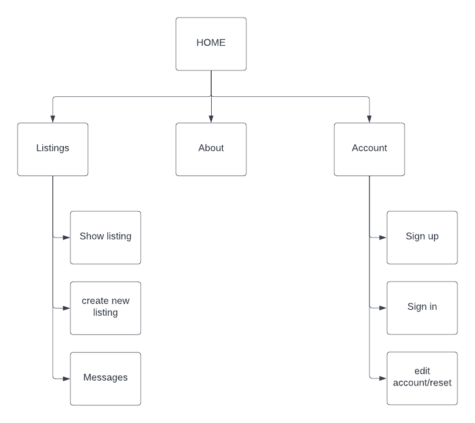

**Purpose**

The purpose of this marketplace app is to provide P2P supply and demand environment where now clients(buyer side) and developers, coders and programmers(seller side) can interact with each other through a transparent direct communication. 

**Functionality / features**

Posting feature:
- Clients can post their listing of what projects they want to have
- Programmers can see the clients’ posts and find projects that fit to their profile

Messaging uploading feature:
- Programmers can contact clients and upload their previous work as samples
- Clients can upload images on their posts
- Clients can contact and reply programmers through the conversation-features

Deletion feature:
- The user is able to delete their own listing
- The user is able to delete their own account

**Sitemap**

**Target audience**

- Programmers, coders, developers
- Clients who want to build projects

**Tech stack**

- rails
- sass-rails
- webpacker
- turbolinks
- jbuilder
- bootsnap
- rspec
- kramdown 
- kramdown-perser-gfm
- jquery-rails
- mini-magick
- html
- css
- heroku
- github
- devise
- trix
- postgresQL

**User stories for your app**

As a product owner, I want to provide more freedom to clients and coders so that they have more options to choose from as an entrepreneur. 

**Detail any third party services that your app will use**

- Devise: for authentication

- Heroku: a cloud platform service

- github: source code repositories

- postgresql: a database system

**Projects models in terms of the relationships (active record associations) they have with each other**

**User model:**

  - devise :database_authenticatable, :registerable,

  - :recoverable, :rememberable, :validatable

  - has_many :listings
  
  - has_one_attached :avatar

**Listing model:**
 
  - belongs_to :user

  - belongs_to :category

  - has_rich_text :description

  - has_one_attached :image

**Message model:**

  - belongs_to :conversation

  - belongs_to :user

  - validates_presence_of :body, :conversation_id, :user_id

**Conversation model:**

  - belongs_to :sender, foreign_key: :sender_id, class_name: "User"

  - belongs_to :recipient, foreign_key: :recipient_id, class_name: "User"

  - has_many :messages

  - validates_uniqueness_of :sender_id, scope: :recipient_id

**The database relations in the application**

Entities: user, listing, categories, messages, conversations.

User:
- User has zero to many listings
- User has zero to many messages

Listing:
- Listing has one and only user
- Listing has one and only category

Category:
- Category has one to many listings

Message:
- Message has one and only user
- Message has one and only conversation

Conversation:
- Conversation has zero to many messages

